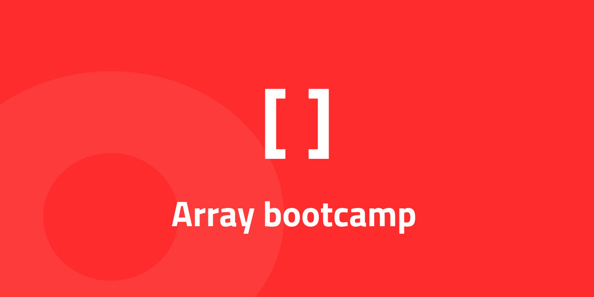

## The Basics

1. Gör en array som innehåller 5 st olika frukter av datatypen `string`.

2. gör en array som innehåller 3 olika datatyper, ex. `string`, `number`, `array`.

```js
let animals = ["cat", "hamster", "parrot", "funky chihuahua"];
```

3. `console.log()` hur många objekt arrayen ovan innehåller.

4. I arrayen ovan, hämta _cat_.

5. I arrayen ovan, hämta _funky chihuahua_.

6. I arrayen ovan, byt ut _hamster_ mot _tiger_.

```js
let a = [1, 2, 3];
let b = [4, 5, 6];
```

7. Lägg ihop ovanstående arrayer.

```js
let a = [1, 2, 3, 7, 8, 9];
let b = [4, 5, 6];
```

8. Merga ner array `b` på index `3` array `a`.

```js
let arr = ["a", "b", "c"];
```

9. _Klona_ ovanstående array.

## Methods

**.push(), .unshift(), .pop(), .shift(), .splice(), .includes(), .indexOf(), .substring()**

```js
let fruits = ["kiwi", "apple", "pear"];
```

10. Lägg till en frukt i _slutet_ av arrayen ovan.

11. Lägg till en frukt i _början_ av arrayen ovan.

12. I arrayen ovan, ta bort _sista_ frukten i arrayen.

13. I arrayen ovan, ta bort _första_ frukten i arrayen.

14. Sätt in _en_ frukt i arrayen ovan på `index 1`.

15. Sätt in _tre_ frukter i arrayen ovan på `index 2`.

```js
let names = ["David", "Christoffer", "Johan", "Maja"];
```

16. I arrayen ovan, ta bort _Christoffer_ och _Johan_.

```js
let nums = [1, 2, 3, 4, 5, 6, 7, 8, 9];
```

17. Spegelvänd på arrayen ovan.

```js
let str = "Supercalifragilisticexpialidocious";
```

18. Kika om strängen ovan innehåller bokstaven `n`.

19. Kika om strängen ovan innehåller bokstaven `x`.

20. I ovanstående array, hitta vilket _position_ första förekomsten av `p` har.

21. I strängen ovan, plocka fram de `5` _första_ tecknena.

22. I strängen ovan, plocka fram de `7` _sista_ tecknena.

## Advanced methods ( high order methods )

### .filter()

```js
let numArray = [23, 45, 5, 62, 1, 21, 3, 54];
```

23. I arrayen ovan, filtera fram alla nummer _över_ `5`.

24. I arrayen ovan, filtera fram alla nummer _under_ `5`.

```js
let persons = [
  {
    name: "Felicia",
    age: 12,
  },
  {
    name: "Pelle",
    age: 20,
  },
  {
    name: "Peter",
    age: 59,
  },
  {
    name: "Anna",
    age: 32,
  },
  {
    name: "Jocke",
    age: 18,
  },
  {
    name: "Ella",
    age: 3,
  },
];
```

25. Skriv ut alla namn som _är 18 år eller över_ från arrayen ovan.

26. Skriv ut alla namn som är _under 18 år_ från arrayen ovan.

### .sort()

```js
let arr = ["beta", "alfa", "gamma"];
```

27. Sortera ovanstående array _alfabetisk_.

```js
let nums = [1, 5, 7, 9, 3, 4, 2, 6, 8];
```

28. Sortera ovanstående array _numeriskt_.

29. I person-arrayen ovan, sortera objekten efter ålder, _yngst_ först.

30. I person-arrayen ovan, sortera objekten efter ålder, _äldst_ först.

31. I person-arrayen ovan, sortera objekten i bokstavsordning efter deras namn

### .map()

32. I person-arrayen ovan, gör om alla namn till _versaler_.

33. I person-arrayen ovan, _spegelvänd_ alla namn.

## Loop arrays

```js
let fruits = ["apelsin", "päron", "äpple", "kiwi"];
```

34. Loopa ut följande array med en `forEach()`-loop. `console.log()` varje ord.

35. Loopa ut följande array med en `for of`-loop. `console.log()` varje ord.

36. Loopa ut följande array med en `for`-loop. `console.log()` varje ord.

37. Loopa ut följande array. För varje varv i loopen ska du också skriva ut index. ex:

```
0 - apelsin
1 - päron
...
```
